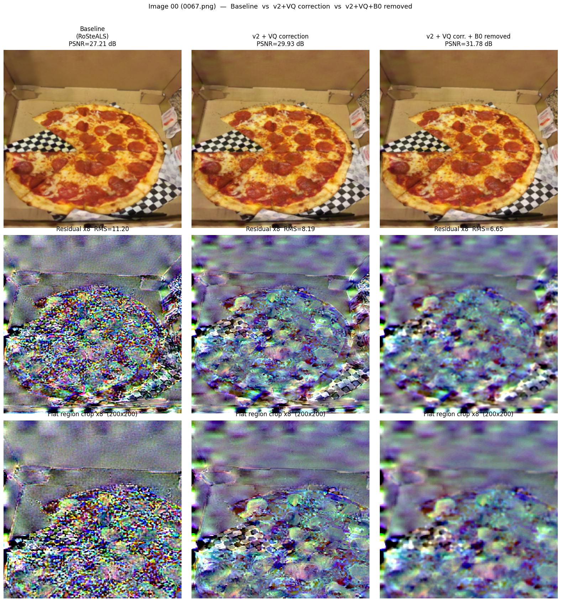
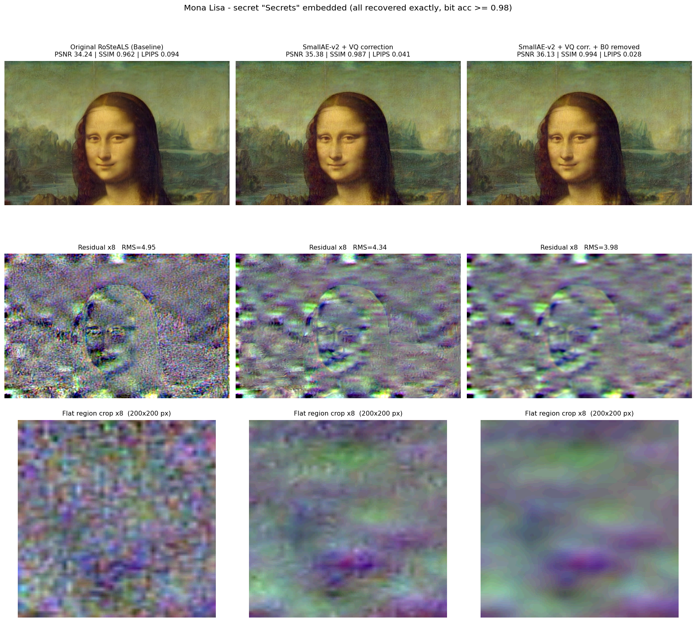

# RoSteALS + SmallAE-v2 Adapter


Post-G adapter for [RoSteALS](https://arxiv.org/abs/2304.03400) that improves image quality while maintaining or exceeding robustness on all 14 ImageNet-C corruptions.

> **Key idea**: Instead of embedding the watermark into the VQ-GAN latent space and passing through the decoder (which introduces reconstruction error), we (1) apply a lightweight SmallAE adapter on top of the VQ-GAN output, then (2) replace VQ-GAN reconstruction error with the pure watermark delta — yielding higher PSNR at no robustness cost.

---

## Pipeline Overview

```
Cover image x
    │
    ▼
[VQ-GAN Encoder E]
    │  z (latent)
    ▼
[SecretEncoder F]  ←  secret (100-bit ECC)
    │  z + eps
    ▼
[VQ-GAN Decoder G]   →   G(z+eps)   [frozen]
    │
    ▼
[SmallAE Adapter A]  →   W = A(G(z+eps))   [trainable ~400K params]
    │
    ▼  VQ Correction:  W' = x + (W − G(z))
    │                       ↑ pure watermark signal, no VQ recon error
    ▼
Watermarked image W'  (PSNR ≈ 34 dB)

[SecretDecoder D] reads W' → recovers secret  [frozen]
```

The VQ correction step removes the inherent reconstruction error of the VQ-GAN decoder, boosting PSNR by ~3 dB with negligible impact on robustness.

---

## Results (CLIC dataset, 530 images, 14 ImageNet-C corruptions, severity 1–5)

| Method | PSNR (dB) | IC avg (%) | Δ IC vs Baseline |
|---|:---:|:---:|:---:|
| **Baseline** (original RoSteALS) | 29.09 | 94.6 | — |
| **SmallAE-v2** | 28.77 | 96.5 | +1.9 |
| **SmallAE-v2 + VQ correction** | 31.97 | 96.3 | +1.7 |
| **SmallAE-v2 + VQ corr. + B0 removal** | **33.92** | **95.8** | **+1.2** |

IC avg = mean bit accuracy (%) across 14 corruption types after attack.

### Per-attack robustness (CLIC, %)

| Attack | Baseline | v2 + VQ | v2 + VQ + B0 |
|---|:---:|:---:|:---:|
| Gaussian noise | 86.7 | 90.5 | 89.3 |
| Shot noise | 87.6 | 91.3 | 90.2 |
| Impulse noise | 90.1 | 93.6 | 92.7 |
| Defocus blur | 96.1 | 96.9 | 96.9 |
| Frost | 92.4 | 95.9 | 95.6 |
| Fog | 98.0 | 98.9 | 98.7 |
| Brightness | 99.3 | 99.2 | 99.1 |
| Contrast | 98.0 | 99.0 | 98.6 |
| Pixelate | 99.4 | 99.4 | 99.3 |
| JPEG compression | 90.0 | 93.4 | 92.2 |
| Speckle noise | 91.4 | 93.9 | 93.0 |
| Gaussian blur | 98.1 | 98.5 | 98.4 |
| Spatter | 98.2 | 98.8 | 98.6 |
| Saturate | 98.8 | 98.9 | 98.5 |
| **IC avg** | **94.6** | **96.3** | **95.8** |

### Visual comparison (Image 00 — 0067.png from CLIC)



> Top row: watermarked images. Middle row: residual ×8. Bottom row: flat-region crop ×8.

### Mona Lisa example



| | Baseline | v2 + VQ | v2 + VQ + B0 |
|---|---|---|---|
| PSNR | 34.24 dB | 35.38 dB | **36.13 dB** |
| SSIM | 0.962 | 0.987 | **0.994** |
| LPIPS | 0.094 | 0.041 | **0.028** |
| Bit acc | 0.99 | 0.99 | 0.98 |

---

## Quick Start

### Option A: Docker (recommended)

```bash
# Build
docker build -t rosteals-adapter .

# Download weights (first time)
docker run --rm -v $(pwd)/models:/workspace/RoSteALS-main/models \
    rosteals-adapter bash download_models.sh

# Embed a secret (v2 + VQ correction)
docker run --gpus all --rm \
    -v $(pwd)/models:/workspace/RoSteALS-main/models \
    -v $(pwd)/examples:/workspace/RoSteALS-main/examples \
    rosteals-adapter python inference_v2.py \
        --secret "Secrets" \
        --cover examples/monalisa.jpg \
        --output examples/monalisa_out.png

# With B0 removal (+1.9 dB PSNR, -0.5%p IC avg)
docker run --gpus all --rm \
    -v $(pwd)/models:/workspace/RoSteALS-main/models \
    -v $(pwd)/examples:/workspace/RoSteALS-main/examples \
    rosteals-adapter python inference_v2.py \
        --secret "Secrets" \
        --cover examples/monalisa.jpg \
        --output examples/monalisa_b0.png \
        --drop_b0
```

### Option B: Local install

```bash
# 1. Clone
git clone https://github.com/kjw20010818/RoSteALs-Adapter.git
cd RoSteALs-Adapter

# 2. Install dependencies (Python 3.8 + CUDA 11.3 recommended)
pip install torch==1.11.0+cu113 torchvision==0.12.0+cu113 \
    --extra-index-url https://download.pytorch.org/whl/cu113
pip install -r requirements.txt

# 3. Download model weights
bash download_models.sh
# Downloads:
#   models/RoSteALS/epoch=000017-step=000449999.ckpt  (RoSteALS base, 520MB)
#   models/first_stage_models/vq-f4/model.ckpt        (VQ-GAN, frozen)

# 4. Download SmallAE-v2 adapter checkpoint
#    (see Adapter Weights section below)

# 5. Run inference
python inference_v2.py \
    --secret "Secrets" \
    --cover examples/monalisa.jpg \
    --output examples/out.png
```

---

## Inference Scripts

### `inference_v2.py` — SmallAE-v2 + VQ correction (this repo)

```
python inference_v2.py \
    --config       models/VQ4_small_ae_v2.yaml \
    --base_weight  models/RoSteALS/epoch=000017-step=000449999.ckpt \
    --adapter_weight <path/to/small_ae_v2.ckpt> \
    --secret       "Secrets" \
    --cover        examples/monalisa.jpg \
    --output       examples/out.png \
    [--drop_b0]            # remove highest-frequency band (+1.9dB PSNR, -0.5%p IC)
    [--no_vq_correction]   # disable VQ correction (pure adapter output)
```

### `inference.py` — Original RoSteALS baseline

```
python inference.py \
    --config  models/VQ4_mir_inference.yaml \
    --weight  models/RoSteALS/epoch=000017-step=000449999.ckpt \
    --secret  "Secrets" \
    --cover   examples/monalisa.jpg \
    --output  examples/out_baseline.png
```

> **Secret format**: up to 7 ASCII characters. BCH error correction encodes the text into 100 bits internally.

---

## Adapter Weights

| Checkpoint | Description | Link |
|---|---|---|
| `epoch=000017-step=000449999.ckpt` | Original RoSteALS base model | `bash download_models.sh` |
| `small_ae_v2.ckpt` | SmallAE-v2 adapter (~400K params) | *(see note below)* |

> The SmallAE-v2 adapter checkpoint is fine-tuned on the MIR-Flickr dataset (100k images) for 35k steps. Contact the repository maintainer or train your own using the instructions below.

---

## Train Your Own Adapter

```bash
python scripts/train_post_g_adapter.py \
    --config models/VQ4_small_ae_v2.yaml \
    --pretrain_ckpt models/RoSteALS/epoch=000017-step=000449999.ckpt \
    --output /path/to/output \
    --gpus 1 \
    --batch_size 4
```

**Data**: MIR-Flickr 100k ([download first tar](https://press.liacs.nl/mirflickr/mirflickr1m.v3b/images0.zip)). Update `data.params.train.params.data_root` in the YAML.

**Key hyperparameters in `VQ4_small_ae_v2.yaml`**:

| Parameter | Default | Effect |
|---|---|---|
| `adapter_hidden` | 32 | Base channel count; ↑ = more capacity |
| `adapter_n_down` | 1 | Downsampling stages (1 = 128×128 bottleneck) |
| `adapter_smooth_delta` | true | Gaussian smoothing on delta (reduces block artifacts) |
| `lambda_preserve` | 3.0 | Weight for keeping adapter output close to G output |
| `lambda_lpips` | 1.0 | Perceptual loss weight |
| `use_vq_correction` | true | Enable VQ error correction during training |

Only the adapter weights are updated during training; the VQ-GAN, SecretEncoder, and SecretDecoder are all frozen.

---

## Method Details

### SmallAE Adapter

A lightweight convolutional autoencoder (~400K parameters) applied after the VQ-GAN decoder:

```
image_wm [3×256×256]
    → Encoder: 3→32→64ch, 256→128 (n_down=1)
    → FiLM conditioning on 100-bit secret
    → Decoder: 64→32ch, 128→256 + FiLM
    → delta (zero-initialized)
image_out = clamp(image_wm + exp(log_α) × delta)
```

### VQ Correction

The VQ-GAN decoder introduces reconstruction error `G(z) − x_orig` independent of the watermark. We remove it:

```
W  = A(G(z + eps))          # adapter output
wm = W − G(z)               # pure watermark signal
W' = x_orig + wm            # apply only watermark onto original
```

Effect: PSNR improves by ~3 dB; robustness is statistically unchanged (Δ IC avg < 0.2%p across 14 attacks on 530 CLIC images).

### B0 Removal (optional post-processing)

The watermark residual contains a high-frequency band (σ ≤ 1px, "B0") that carries ~44% of residual energy but only ~0.6%p of robustness. Removing it via Gaussian low-pass filter improves PSNR by +1.9 dB at negligible cost:

```python
wm_clean = gaussian_blur(wm, sigma=1.0)   # removes B0
W' = (x_orig + wm_clean).clamp(-1, 1)
```

---

## Evaluation

Run the full controlled evaluation (CLIC + MetFaces, all 14 ImageNet-C corruptions):

```bash
python scripts/eval_b0_removal.py
# Output: results/eval_b0_removal.json
```

Or the minimal v2 vs VQ correction comparison:

```bash
python scripts/eval_vq_correction_fixed.py
# Output: results/eval_vq_correction_fixed.json
```

---

## Project Structure

```
RoSteALs-Adapter/
├── cldm/
│   ├── post_g_adapter.py   # SmallAE adapter, ControlAEPostG training class
│   ├── diffsteg.py         # SecretEncoder / SecretDecoder architectures
│   ├── ae.py               # VQ-GAN utilities
│   └── ...
├── ldm/                    # Latent diffusion model utilities (from CompVis)
├── tools/
│   ├── ecc.py              # BCH error correction (text ↔ 100-bit)
│   ├── augment_imagenetc.py # ImageNet-C corruption wrapper
│   └── eval_metrics.py     # PSNR / SSIM / LPIPS / SIFID
├── models/
│   └── VQ4_small_ae_v2.yaml  # Main config
├── inference.py            # Original RoSteALS inference
├── inference_v2.py         # SmallAE-v2 + VQ correction inference
├── download_models.sh      # Download base model weights
├── Dockerfile
└── requirements.txt
```

---

## Acknowledgements

- Base model: [RoSteALS](https://arxiv.org/abs/2304.03400) by Bui et al. (CVPR WMF 2023)
- VQ-GAN: [CompVis/stable-diffusion](https://github.com/CompVis/stable-diffusion)
- Robustness evaluation: [ImageNet-C](https://github.com/hendrycks/robustness)

## Citation

If you use this work, please cite the original RoSteALS paper:

```bibtex
@InProceedings{bui2023rosteals,
  title     = {RoSteALS: Robust Steganography using Autoencoder Latent Space},
  author    = {Bui, Tu and Agarwal, Shruti and Yu, Ning and Collomosse, John},
  booktitle = {Proc. CVPR WMF},
  year      = {2023}
}
```

## License

CC BY-NC-SA 4.0 — non-commercial use only, same license as the original RoSteALS.
